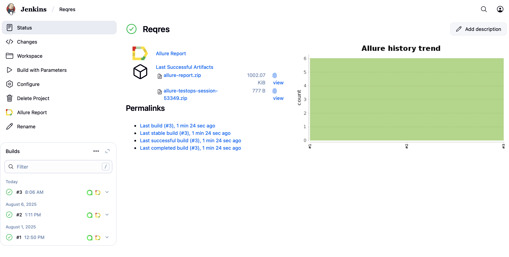
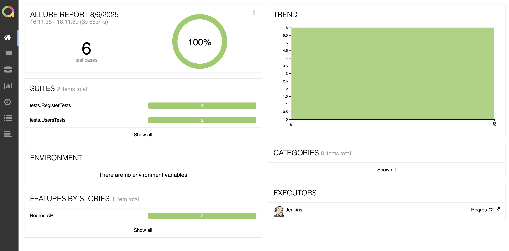
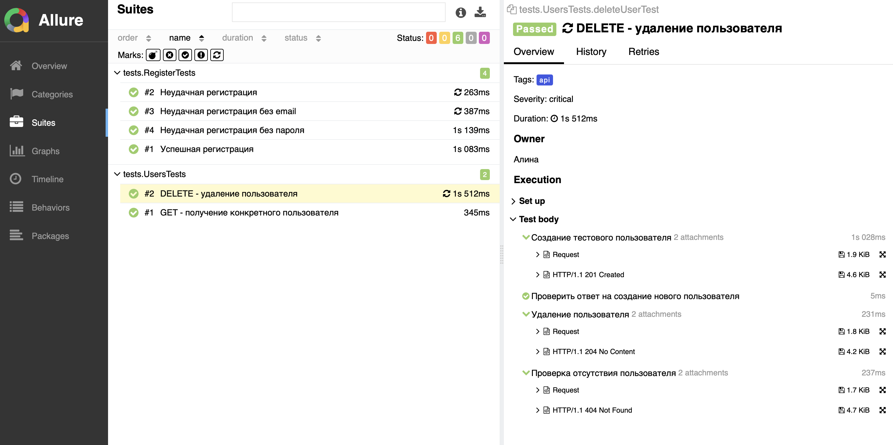
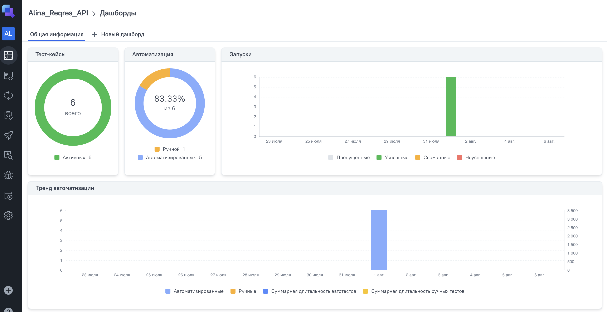
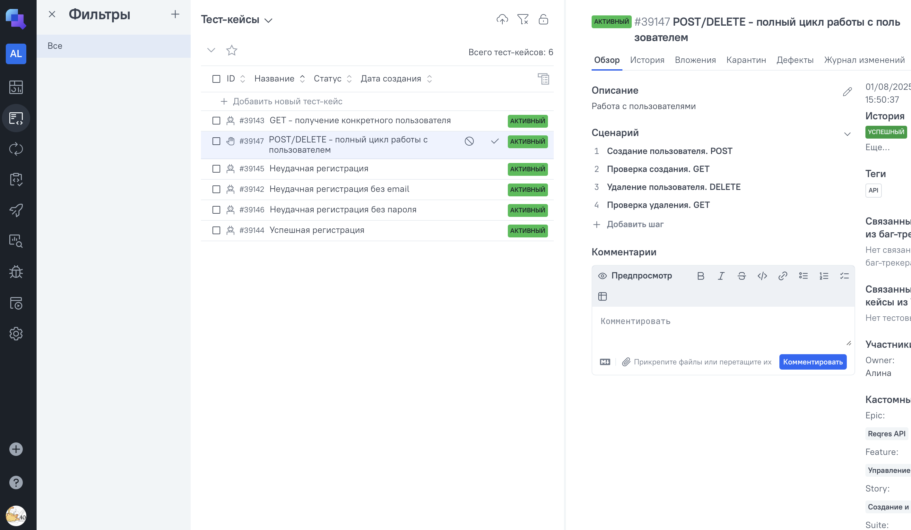
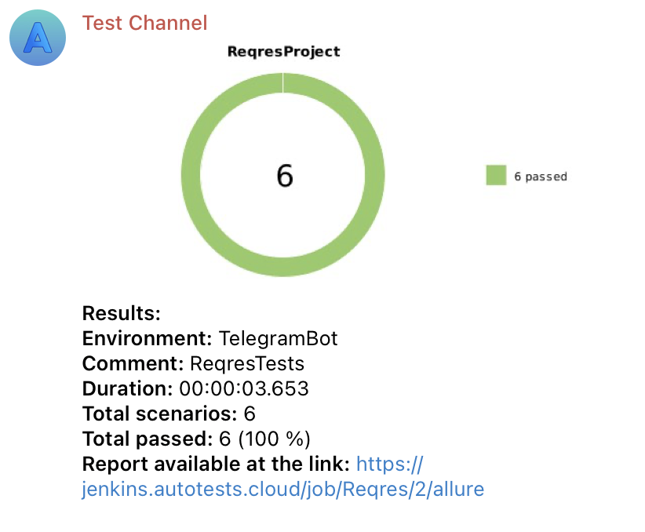

# Проект по автоматизации тестовых сценариев для сайта компании Reqres <a href="https://reqres.in"> 

## 📔 Содержание:
- Технологии и инструменты
- Описание API-тестов
- Сборка в Jenkins
- Запуск автотестов
- Allure отчет
- Allure TestOps
- Уведомления в Telegram

## 🛠 Технологии и инструменты: 

| Java | IntelliJ <br> Idea | GitHub | JUnit <br> 5 | Gradle | REST <br> Assured | Alurre <br> Report | Jenkins | Telegram | TestOps |
|------|--------------------|--------|--------------|--------|-------------------|--------------------|---------|----------|---------|
|[](https://www.java.com) | [](https://www.jetbrains.com/idea/) | [](https://github.com) | [](https://junit.org/junit5/) | [](https://gradle.org) | [](https://reqres.in) | [](https://docs.qameta.io/allure/) | [](https://www.jenkins.io) | [](https://telegram.org) | [](https://qameta.io) |

## ☑️ Описание API-тестов
- Все тесты помечены тегом @Tag("api")
- Используется степовый подход с описанием действий через step()
- Используются спецификации для валидации ответов
- Тесты независимы друг от друга
### Структура тестов
Тесты разделены на 2 основных класса:
- UsersTests - тестирование функционала управления пользователями
- RegisterTests - тестирование регистрации пользователей
### Описание реализованных проверок
#### UsersTests - Управление пользователями
1. Проверка работы GET-запроса для получения данных о пользователе
- Успешное получение данных существующего пользователя
- Попытка получения несуществующего пользователя
2. Проверка полного жизненного цикла пользователя (создание → проверка → удаление)
- Создание нового пользователя (POST /users)
- Удаление созданного пользователя (DELETE /users/{id})
- Проверка отсутствия удаленного пользователя
#### RegisterTests - Регистрация пользователей
1. Проверка успешной регистрации с валидными данными
2. Попытка регистрации без email и пароля
3. Попытка регистрации без указания пароля
4. Попытка регистрации без указания email
   
##  Сборка в [Jenkins](https://jenkins.autotests.cloud/job/Reqres/)
<p align="center">

</p> 

### Параметры сборки в Jenkins:
- TASK (api)

## ▶️ Запуск автотестов

### Запуск тестов из терминала

```bash
gradle clean test
```

### Запуск тестов на удаленном браузере

```bash
- clean test
```

##  [Allure Report](https://jenkins.autotests.cloud/job/Reqres/allure/)
### Overview
<p align="center">  

</p>  

### Тест-кейсы
<p align="center">  

</p>  

##  [Allure TestOps](https://allure.autotests.cloud/project/4847/test-cases?treeId=0)
<p align="center">  

</p>  

### Ручные и и автоматизированные тест кейсы
<p align="center">  

</p> 

##  Уведомления в Telegram с использованием бота
<p align="center">  

</p>  
